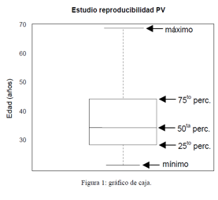

---
# GRÁFICOS   
William Muyulema Chiriboga

## Curso de introducción a R project con el GUI de RStudio.
---
"Es destacable que una ciencia, la cual comenzó con el estudio sobre las chances en los juegos de azar, se haya convertido en el objeto más importante del conocimiento humano… las preguntas más importantes sobre la vida son, en su mayor parte, en realidad sólo problemas de probabilidad"   
                                                                                            Pierre Simon, Marqués de Laplace (1749-1827) 

---

## ESTADISTICA DESCRIPTIVA: Comandos básicos  
Una definición de “estadística descriptiva” es “describir los datos en forma concisa”, la forma más común de describir un conjunto de datos relacionados entre sí es reportar un valor medio y una dispersión alrededor de dicho valor medio (Risk, 2006).    

edad=c(22,22,23,24,25,25,26,27,28,29,29,29,29,29,31,31,32,33,34,35,35,35,36,38,39,39,42,42,44,44,45,45, 45,47,48,52,59,66,67,69,69)   

|  |  |  |  |
| - | - | - | - |
| length(edad) | length(edad) = 41| var(edad) |var(edad) =1717.55 |
| mean(edad) | mean (edad) =38.26 |  sd (edad) |  sd (edad) = 13.09 |
| median(edad) | median (edad) =35 |  quantile (edad,0.5)  |  quantile (edad, 0.5) = 50% 35  |
| moda(edad) | moda (edad) = 29 |  fivenum (edad)= | 22 29 35 45 69 |
| range(edad) |range (edad) = 22.69 | 100* sd (edad)/mean (edad) | 34.22 |

---
La estadística descriptiva nos permite caracterizar con números un conjunto de datos, sin embargo en ciertas ocasiones un gráfico permite comunicar mejor las características de los datos. 

---
La estadística descriptiva nos permite caracterizar con números un conjunto de datos, sin embargo en ciertas ocasiones un gráfico permite comunicar mejor las características de los datos. 

## Gráficos unidimensionales

 ### >boxplot()

Se usa para graficar una o mas variables en cajas

>boxplot(objeto1,main=“titulo principal”,ylab=“nombre y”)

>boxplot(edad)   
>boxplot(edad,main="Edad reproductiva")   
>boxplot(edad,main="Edad reproductiva", ylab="Edad (años)") # en x?   

---
## Gráficos unidimensionales

### >hist () 
se usa para observar la distribución de una variable numérica.     

Una desventaja del histograma como estimador de una distribución es que su forma depende del ancho elegido para los intervalos, lo que modifica el número de casos en cada barra (y la simetría observada).   
>hist()   
>hist(name,main=“titulo", xlab=“titulo",ylab=“titulo")    

---

### >Density () 

Estima la densidad de una variable numérica, usando una grilla de intervalos de la variable y aproximaciones lineales para producir un gráfico continuo. Se grafica con el comando: plot( density(variable) ).   

> plot( density(edad), main=“Densidad de  edad”, xlab=“edad (años)” )

---
### >lines(density(name, na.rm=T) )
 
El comando lines se usa para agregar información a un gráfico existente. Si usáramos plot( density(talla) ) se borraría el histograma.   

>hist(edad, probability=T, main="Distribución de edad")
> lines( density(edad, na.rm=T) 

---
## … más opciones útiles (para hist, plot, etc.)

|  |  |
| - | - |
|#Colores de componentes del gráfico | |                
| col=“color”	# color de las barras | 1. black |                
| col=codigo 	# color de las barras | 2. red |
| col.axis=“color”	# de valores en ejes X e Y | 3. green |
| col.lab=“color”	# de textos en ejes X e Y |4. blue  |
| col.main=“color”	# de texto en título principal | 5. pale blue |
| col.sub=“color”	# de texto en subtítulo  | 6. purple |
|  | 7. yellow | 
|#Tamaño de textos| |    
| cex.axis=valor	# de valores en ejes X e Y | Por defecto, los textos |    
| cex.lab=valor	# de textos en ejes X e Y | tienen tamaño 1 y el |    
| cex.main=valor	# de texto en título principal | título 1.2 |    
| cex.sub=valor	# de texto en subtítulo   |pulgadas |  
|  |  | 
|#Fonts | |   
| font.axis=valor	# de valores en ejes X e Y  | 1. plaint text |  
| font.lab=valor	# de textos en ejes X e Y  | 2. bold face|   
| font.main=valor	# de texto en título principal | 3. italic |    
| font.sub=valor	# de texto en subtítulo   | 4. bold italic |  

---
### Ejercicio 1:
Utilice su vector “IMC” y realice un grafico de caja acinturado de color rojo con borde verde. Indique un titulo al gráfico y un nombre a la variable ambos color azul.

### Ejercicio 2:    
Utilice su objeto “IMC” y realice un histograma de cinco barras

---
## Gráficos bidimensionales

### Opciones útiles para gráficos de 2 ejes   

|  |  |   
| - | - |   
| main=“texto” |  		# título principal del gráfico |
| sub=“texto” | 		# subtítulo del gráfico |
| xlab=“texto” | 		# título para el eje X |
| ylab=“texto” | 		# título para el eje Y |
| xlim=c(0,2) | 		# limites inferior y superior eje X |
| ylim=c(0,250) | 		# limites inferior y superior eje Y |
| probability=T	 |	# grafica probabilidad en vez de frecuencias |
| freq=T |			# grafica frecuencias en vez de probabilidad |
| labels=T| 		# muestra el valor sobre cada barra0 |

---
## Par ()

El comando par permite indicar los parámetros de modo que afecten a todos los gráficos. Además, algunas opciones no pueden darse directamente en hist u otros comandos gráficos, como bg (color de fondo del gráfico) y fg (color de foreground).   
> par(col.main="blue", cex.main=1.5, fg="black", bg="cyan“, font.main=4)   

Una de las opciones más importantes de par es la posibilidad de hacer múltiples gráficos sobre un mismo dispositivo, con las opciones mfrow y mfcol.   
|  |  |
| - | - |
| > par(mfrow=c(1,2)) |	# hace una fila de dos gráficos |
| > par(mfcol=c(2,2)) | 	# hace dos columnas de dos gráficos cada una |

