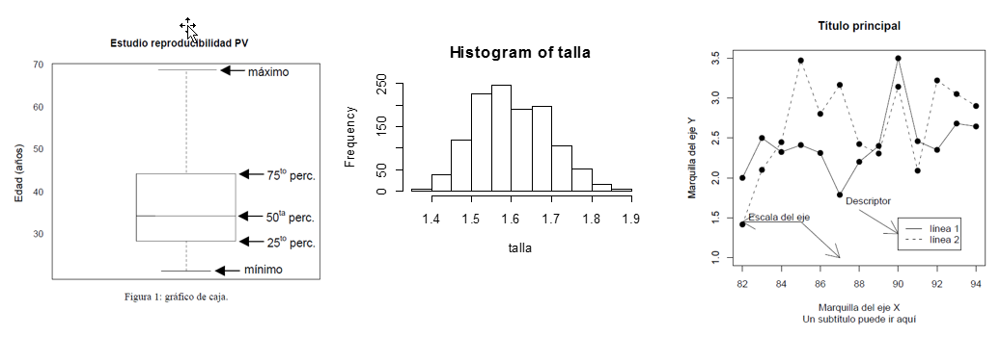

---
# GRÁFICOS   
William Muyulema Chiriboga

## Curso de introducción a R project con el GUI de RStudio.
---
"Es destacable que una ciencia, la cual comenzó con el estudio sobre las chances en los juegos de azar, se haya convertido en el objeto más importante del conocimiento humano… las preguntas más importantes sobre la vida son, en su mayor parte, en realidad sólo problemas de probabilidad"   
                                                                                            Pierre Simon, Marqués de Laplace (1749-1827) 

---

## ESTADISTICA DESCRIPTIVA: Comandos básicos  
Una definición de “estadística descriptiva” es “describir los datos en forma concisa”, la forma más común de describir un conjunto de datos relacionados entre sí es reportar un valor medio y una dispersión alrededor de dicho valor medio (Risk, 2006).    

edad=c(22,22,23,24,25,25,26,27,28,29,29,29,29,29,31,31,32,33,34,35,35,35,36,38,39,39,42,42,44,44,45,45, 45,47,48,52,59,66,67,69,69)   

|  |  |  |  |
| - | - | - | - |
| length(edad) | length(edad) = 41| var(edad) |var(edad) =1717.55 |
| mean(edad) | mean (edad) =38.26 |  sd (edad) |  sd (edad) = 13.09 |
| median(edad) | median (edad) =35 |  quantile (edad,0.5)  |  quantile (edad, 0.5) = 50% 35  |
| moda(edad) | moda (edad) = 29 |  fivenum (edad)= | 22 29 35 45 69 |
| range(edad) |range (edad) = 22.69 | 100* sd (edad)/mean (edad) | 34.22 |

---
La estadística descriptiva nos permite caracterizar con números un conjunto de datos, sin embargo en ciertas ocasiones un gráfico permite comunicar mejor las características de los datos. 

---
La estadística descriptiva nos permite caracterizar con números un conjunto de datos, sin embargo en ciertas ocasiones un gráfico permite comunicar mejor las características de los datos. 

## Gráficos unidimensionales

 ### >boxplot()

Se usa para graficar una o mas variables en cajas

>boxplot(objeto1,main=“titulo principal”,ylab=“nombre y”)

>boxplot(edad)
>boxplot(edad,main="Edad reproductiva")
>boxplot(edad,main="Edad reproductiva", ylab="Edad (años)") # en x?
