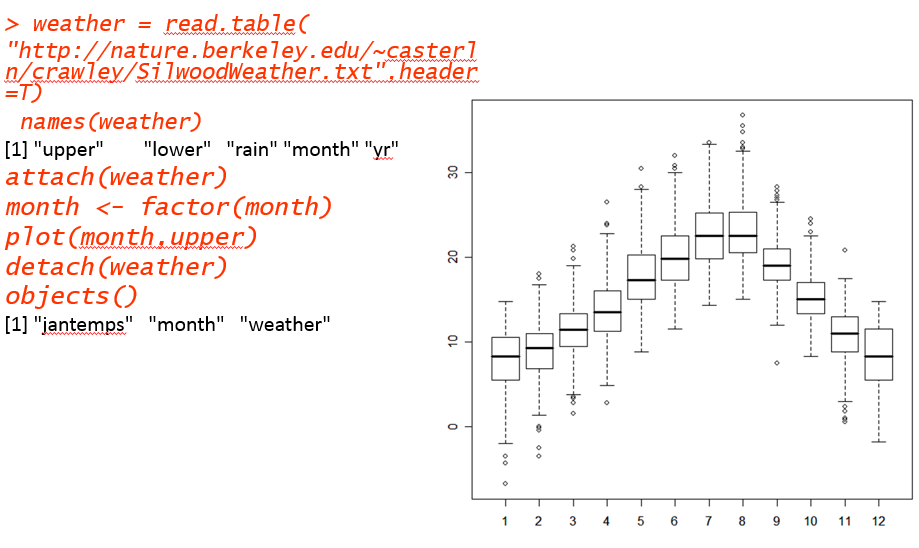

# MANEJO DEL SOFTWARE “R” 

## PARA EL ANÁLISIS DE RIESGOS

### Ing. William Muyulema Chiriboga PhD (c)

========================

---
¿ Porque “R” ?
========================
* R es un lenguaje de [programación interpretado](https://www.ecured.cu/Lenguaje_interpretado)
* De distribución libre, bajo Licencia [GNU .(Gómez.M,2005,p3)](http://www.informatica.us.es/~ramon/articulos/LicenciasSoftware.pdf), Y se mantiene en un ambiente para el cómputo estadístico y gráfico.
* Multiplataforma (corre en Linux, Windows y Mac)

Nos inclinaremos hacia el lado de la programación (lenguaje)más que tocar los aspectos estadísticos.

---
# HISTORIA DE “R” Y  S
* R fue creado en 1992 en Nueva Zelanda por Ross [Ihaka](https://en.wikipedia.org/wiki/Ross_Ihaka) y Robert [Gentleman](https://en.wikipedia.org/wiki/Robert_Gentleman_(statistician)) (Ihaka [1998]).
* A modo de broma Ross y Robert, comienzan a llamar “R” al lenguaje que implementaron, y desde entonces así se le conoce en la muy extendida comunidad amante de dicho lenguaje. 
* S un lenguaje que fue desarrollado por John Chambers y colaboradores en Laboratorios Bell (AT&T)
*  R es una evolución de S,

---

# Instalación de R sobre Windows.
R

Rstudio

---

# Interfaz de Rstudio

---
# Características Importantes de “R”
El sistema R esta dividido en dos partes conceptuales: 
1) El sistema base de R, que es el que puedes bajar de 	CRAN; y, 
2) En todo lo demás. La funcionalidad de R consta de paquetes modulares. El sistema base de R contiene 	el paquete básico que se requiere para su ejecución y la mayoría de las funciones fundamentales. 
3) Los otros paquetes contenidos en 	la “base” del sistema incluye a utils, stats, datasets, graphics, grDevices, grid, tools, parallel, compiler, splines, tcltk, stats4.
---

# Características Importantes de “R”

La capacidad de gráficos de R es muy sofisticada y mejor que la de la mayoría de los paquetes estadísticos

R es muy útil para el trabajo interactivo, pero también es un poderoso lenguaje de programación para el desarrollo de nuevas herramientas
---
Al ser software libre lo hace un lenguaje atractivo, debido a que no hay que preocuparse por licencias y cuenta con la libertad que garantiza GNU. Es decir con R se tiene la libertad de: 
1) 	Correrlo para cualquier propósito, 
2) 	Estudiar como trabaja el programa y adaptarlo a sus necesidades, pues se tiene acceso al código fuente, 
3) 	Redistribuir copias, y 
4) 	Mejorar el programa y liberar sus mejoras al público en general

---
Es importante mencionar que, debido a su estructura, R consume mucho recurso de memoria, por lo tanto si se utilizan datos de tamaño enorme, el programa se alentaría o, en el peor de los casos, no podría procesarlos.
Tienen solución, principalmente teniendo cuidado de vectorizar el código; ya que esto permitiría particionarlo y aprovechar en procesamiento paralelo en equipos con multi-núcleos.

---
# Modo de Trabajo
Se comienza con el modo interactivo (en la consola) haciendo pruebas y utilizándolo como manual de ayuda.
La serie de comandos que devuelven los resultados esperados se guardan y modifican (en el editor) como scripts para crear rutinas reproducibles y automatizables.

---

# Estructura de un Proyecto

Es recomendable que cada proyecto tenga las carpetas (no es camisa de fuerza pero sirve para el orden):
datos, documentos, graficos, imagenes, notas, scripts

Crear una carpeta de proyecto para el curso y dentro de esta crear las carpetas anteriores.

--- 

 
 ---

# Manos a la Obra

getwd()
dir() ó list.files()
setwd ()
dir. Create (‘ xxx’) # ojo con la comillas
file.crate(‘xxx’)
file. Info(‘xxx’)# información sobre un archivo cualquiera

--- 

file.rename(‘from to’) # renombrar el archivo
file.exists (‘xxx’) # es lógico True and False
History()
Ctrol+L #borra la consola
rm(list=ls()) # borra todo lo del espacio del trabajo 
save.image(‘xxxx.R’)# guarda el script 

---
Load(‘xxx.R’) # lee los script que están en la carpeta
data() #muestra los datos de ejemplos disponibles
<- #genera un objeto es similar a =
“” ó ‘’ #declara texto
help(‘[[‘)

---
## Instalar Paquetes

Para instalar paquetes debemos señalar el siguiente comando:

> install.packages("nombre del paquete")

---
.libpaths()# para saber donde están alojados los paquetes de “R”
update.packages (checkBuilt=T, ask=F) # para actualizar R y paquetes
browseVignettes()
objects() # nos muestra el contenido del espacio de trabajo 

---

# PLOT CON VARIABLES CATEGORICAS

---
# PLOTS DE MULTIVARIABLES

---
# MODELOS BASADOS EN ÁRBOLES

---

## Bibliografía
-	curso-R.Diaz-Uriarte. https://cran.r-project.org/doc/contrib/curso-R.Diaz-Uriarte.pdf
-	R-intro-1.1.0-espanol.1. https://cran.r-project.org/doc/contrib/R-intro-1.1.0-espanol.1.pdf
-	Santana, Julio. (2014) El arte de programar en R. https://cran.rproject.org/doc/contrib/Santana_El_arte_de_programar_en_R.pdf
-	Wickham, H., & Grolemund, G. (2016). R for data science: import, tidy, transform, visualize, and model data. O'Reilly Media, Inc.. (http://r4ds.had.co.nz/)
- icebreakR. https://cran.r-project.org/doc/contrib/Robinson-icebreaker.pdf "buen Manual"
- R para análisis de científicos reproducibles. https://swcarpentry.github.io/r-novice-gapminder-es/
- Available CRAN Packages by name. https://cran.r-project.org/web/packages/available_packages_by_name.html
- Estadística Universidad de Navarra. http://wpd.ugr.es/~bioestad/guia-r-studio/practica-1-r-studio/
